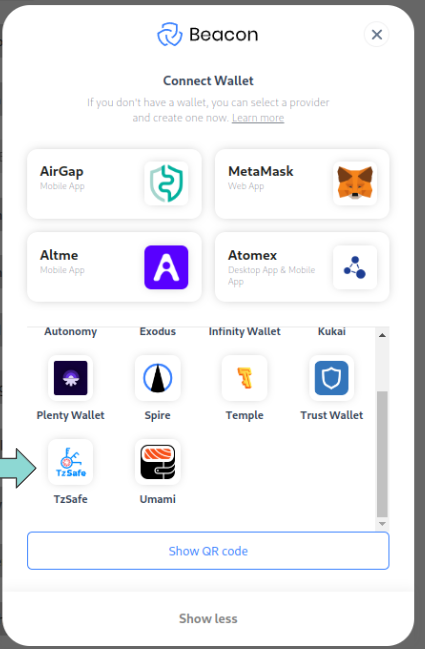

# Logging in Using TzSafe App

## DApp Requirements
- Beacon SDK version 4.1.0 or higher.
- For DApps utilizing the Taquito library, version 17.5.2 or higher is required.

## Demo DApp Example
- see example [here](https://github.com/marigold-dev/example-dapp-with-tzsafe)
