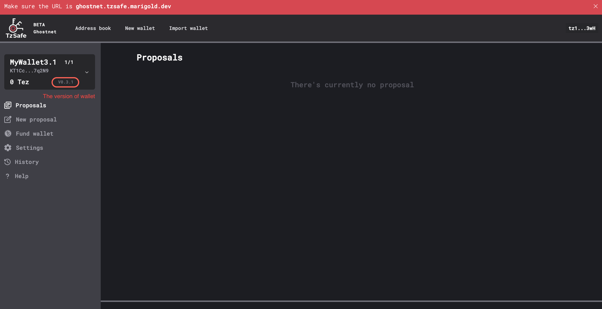
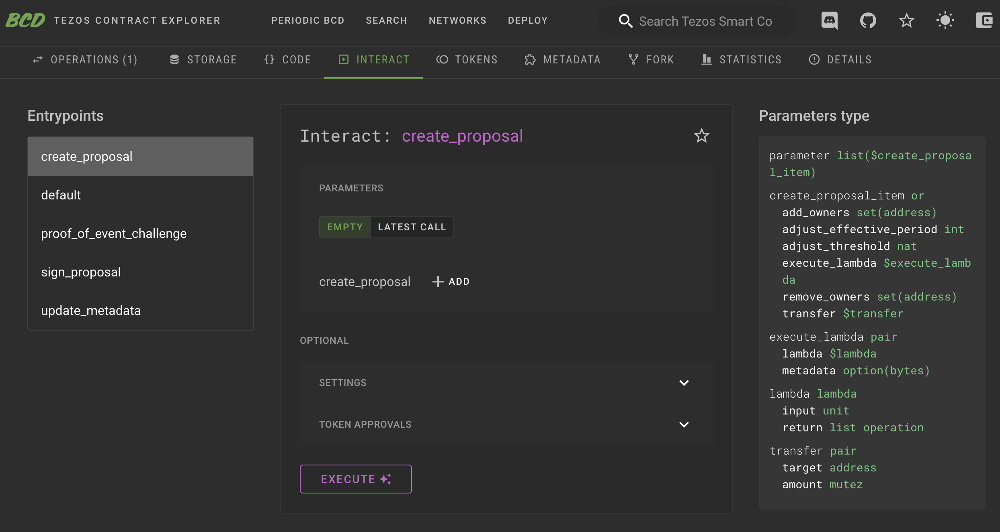
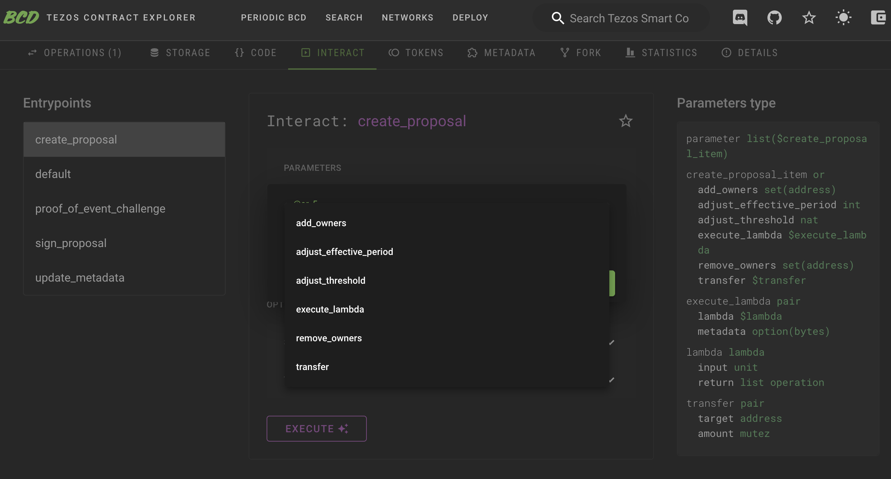
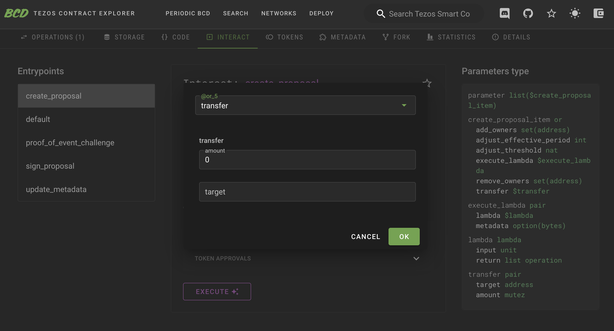
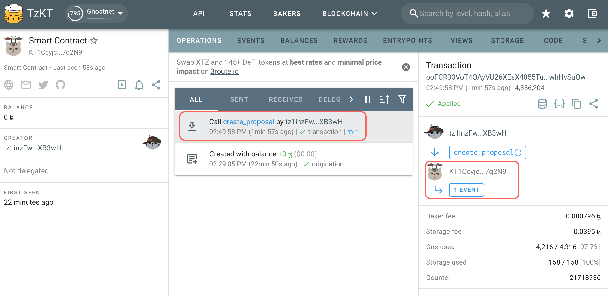
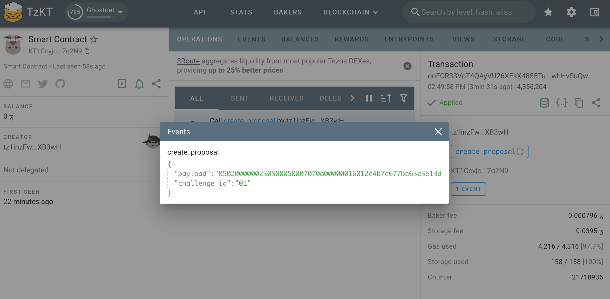
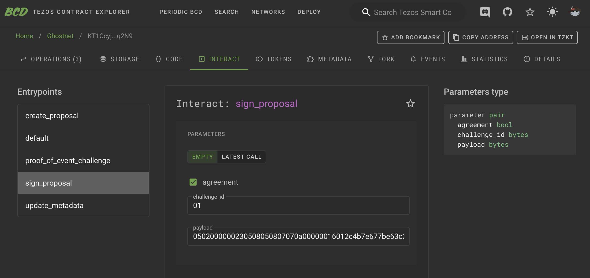
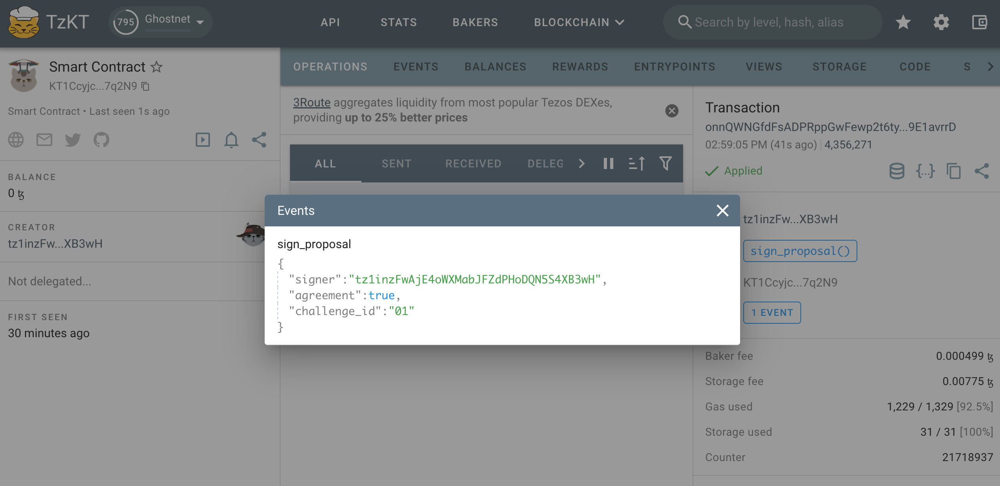
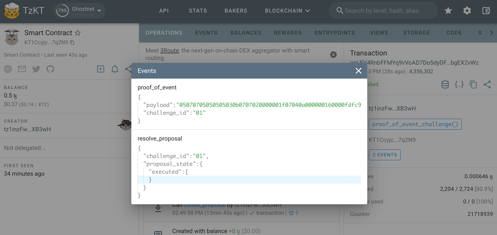

# Understand the Entrypoint and the Proof

TzSafe, a multisig wallet, is created using a smart contract. The TzSafe application, [TzSafe UI](https://tzsafe.marigold.dev), offers a user-friendly interface for interacting with wallets. If users wish to develop their own smart contract to interact with TzSafe, understanding the entrypoints of the wallets is crucial. This section will introduce the entrypoints of TzSafe in different versions. We'll use Better-Call Dev as an example to demonstrate.

To determine the version of TzSafe, there are two ways:

- Within the TzSafe application, you can find the version information as follows:



- The version information follows TZIP-16 specifications and is stored in the metadata within the contract storage.

## Version ≥0.3.1

To align with TZIP-27, TzSafe team offers several proposed models for integration. For more detailed information, please refer to [this link](https://forum.tezosagora.org/t/tzsafe-and-proof-of-event-with-demos/5672). We have chosen to implement the "PoE as an executed action" model, and we will maintain the usage of the term "actions" as a way to distinguish them from Tezos' standard transactions.

💡 Transactions approved through the owners' consensus are referred to as "actions" to differentiate the term from Tezos' standard transactions.

Regarding the interface adaptation, it may seem complex and daunting for users when dealing with the entrypoints and parameters required for signing and resolving proposals. On the contrary, the process is straightforward. Users do not need to calculate signatures or hash data themselves. From proposal creation to resolution, all that's needed is a blocker explorer to check the results of the operations.

### Create a Proposal

The **`create_proposal`** entrypoint is employed to generate proposals, taking a list of proposal contents as its parameter. 



By clicking `+ADD`, we can select the kind of proposal to create.



When designing the TzSafe contract, appropriate annotations are assigned to each variable within the parameters. Consequently, when inspecting the TzSafe contract on Better-Call Dev, interaction is straightforward, as each field is largely self-explanatory.



Upon the successful creation of a proposal by an owner, an event tagged **`%create_proposal`** is emitted.





This event includes two pieces of information that we'll need them to sign and resolve the proposal:

- **`challenge_id`**: This represents a unique ID for each proposal, presented in bytes. With each new proposal, the ID increases by one.
- **`payload`**: This contains the proposal's content but is encoded in Michelson's **`pack`**. If we  **`unpack`** the payload, it should match the input parameter. However, typically, there's no need to **`unpack`**. If the need does arise, we must specify the type, which can be found either:
    - [here](https://github.com/marigold-dev/tzsafe-ui/blob/e9f6dcefc2e08135b9df8b4877c3724181c6d6de/types/Proposal0_3_1.ts#L164) in JSON format.
    - [here](https://github.com/marigold-dev/tzsafe/blob/ae7c7a4785d7af672e0a46ff2de1b4d7f2fcef79/src/internal/proposal_content.mligo#L19) in the camligo. Please note that you need to include this type in the list, as illustrated in the example below.

Here's an example of using **`unpack`** in the camligo:

```
>  git clone git@github.com:marigold-dev/tzsafe.git
>  cd tzsafe
>  cat unpack_proposal_contents.mligo

#import "./tzsafe/src/internal/proposal_content.mligo" "Proposal_content"

type proposal_content = Proposal_content.Types.t
type proposal_contents = proposal_content list

> cat unpack_proposal_contents.mligo
let test_unpack_proposal_contents =
  // remember to add prefix "0x" to the bytes receiving from the event with tag `%create_proposal`
  let bytes = 0x0502000000250508050807070a0000001601361c589d324f1575cccb0adcb58664174c74ee7c000080897a in
  // print unpack result
  Test.log (Bytes.unpack bytes : proposal_contents option)

>  ligo run test unpack_proposal_contents.mligo
Some ([Transfer ({amount = 1000000mutez ; target = KT1DWt1ec76EPrvavMS4Rz95hkYGJFLP3iTp})])
Everything at the top-level was executed.
- test_unpack_proposal_content exited with value ().
```

### Sign a Proposal

The **`sign_proposal`** entrypoint is used to sign a proposal. To sign a proposal, it must first be created. Therefore, we can only provide the **`challenge_id`** and **`payload`** obtained during the proposal creation. If we agree to execute the proposal, the **`agreement`** field should be set to **`true`** (check the checkbox); otherwise, it should be set to **`false`**(uncheck the checkbox).



TzSafe requires **`payload`** to be provided again in **`sign_proposal`** to prevent reorgs. By verifying both the **`challenge_id`** and **`payload`**, TzSafe ensures that we are executing the intended content.

Once the signing is completed, an event is emitted with the tag **`%sign_proposal`**. This event is simply for displaying the signing result.



### Resolve a Proposal and Generate the Proof

The entrypoint for resolving is named **`challenge_proof_of_event`** in accordance with TZIP-27. However, it can only be successfully performed when certain conditions are met. Please see [here](./sign-reject-and-resolve-proposals.md) for more details.

Similar to signing a proposal, we need to provide the **`challenge_id`** and **`payload`** obtained during proposal creation to ensure that reorgs have occurred.


When this entrypoint is successfully executed, two events are emitted:

1. An event with the tag **`%resolve_proposal`** shows the simple result of the proposal, including whether it was `executed`, `rejected`, or `expired`. In most cases, this information is sufficient.
2. The other event, tagged as **`%proof_of_event`**, serves as *the proof of event* for TZIP-27. This proof contains a pair of **`challenge_id`** and **`payload`**. The payload is encoded in Michelson's **`pack`** . If we perform **`unpack`**, we can access the details of the proposal, including signers, resolvers, contents, and more. The type for **`unpack`** can be found:
    - [here](https://github.com/marigold-dev/tzsafe-ui/blob/e9f6dcefc2e08135b9df8b4877c3724181c6d6de/types/Proposal0_3_1.ts#L42) in JSON format.
    - [here](https://github.com/marigold-dev/tzsafe/blob/ae7c7a4785d7af672e0a46ff2de1b4d7f2fcef79/src/internal/storage.mligo#L38) in the camligo.



Here is an example of using **`unpack`** in the camligo:

```
>  git clone git@github.com:marigold-dev/tzsafe.git
>  cd tzsafe
>  cat unpack_proposal.mligo
#import "./tzsafe/src/internal/storage.mligo" "Storage"

type proposal = Storage.Types.proposal

let test_unpack_proposal =
  // remember to add prefix "0x" to the bytes receiving from the proof
  let bytes = 0x05070705050505030b0707020000001f07040a00000016000101e9a6d43af927384fcd1068ffc12e461e219f20030a070707070a00000016000101e9a6d43af927384fcd1068ffc12e461e219f2000bfe9bbd30c0707050907070a00000016000101e9a6d43af927384fcd1068ffc12e461e219f2000a7edbbd30c02000000230508050807070a000000160142d3fb211660bcec97e8117919c549337a2cb425000001 in

  // print unpack result
  Test.log (Bytes.unpack bytes : proposal option)

>  ligo run test unpack_proposal.mligo
Some ({contents = [Transfer ({amount = 1mutez ; target = KT1Eg8784FTRicrRW9nt13fvRh1hYKWwFF9X})] ; proposer = {actor = tz28VMEvxy1pwb7prrvGwLw4bQf2eCMn6P1c ; timestamp = timestamp(2023-10-24T08:04:15Z)} ; resolver = Some ({actor = tz28VMEvxy1pwb7prrvGwLw4bQf2eCMn6P1c ; timestamp = timestamp(2023-10-24T08:08:07Z)}) ; signatures = [tz28VMEvxy1pwb7prrvGwLw4bQf2eCMn6P1c -> true] ; state = Executed (())})
Everything at the top-level was executed.
- test_unpack exited with value ().

```

Both users and DApps can track the new actions of TzSafe without being inconvenienced by internal TzSafe operations by monitoring the events **`%proof_of_event`** or **`%resolve_proposal`** tags. We can utilize APIs provided by TZKT or Taquito to assist us in this regard.

## Version ≤ 0.1

In contrast to version ≥ 0.3.1, the entrypoints and their parameters are self-explanatory and presented in readable types, ensuring a user-friendly interaction with them on Better-Call Dev for developing.

Events are still emitted when proposals are created, signed, and resolved. It's important to note that there is no proof emitted to conform to the TZIP-27 standard.

Please note that there is a legacy proposal content, `execute` of `create_proposal`, in the contract. The legacy proposal content functions the same as `transfer`. The `execute` was designed to be able to customizabled the type when users generate contracts, allowing the wallet to call other specific contracts. In some cases, if the wallet consistently interacts with a specific contract, this can save on storage and gas fees. Now, we are inclined to use `execute_lambda` to replace `execute`, so the `execute` version has been removed in version ≥ 0.3.1.
